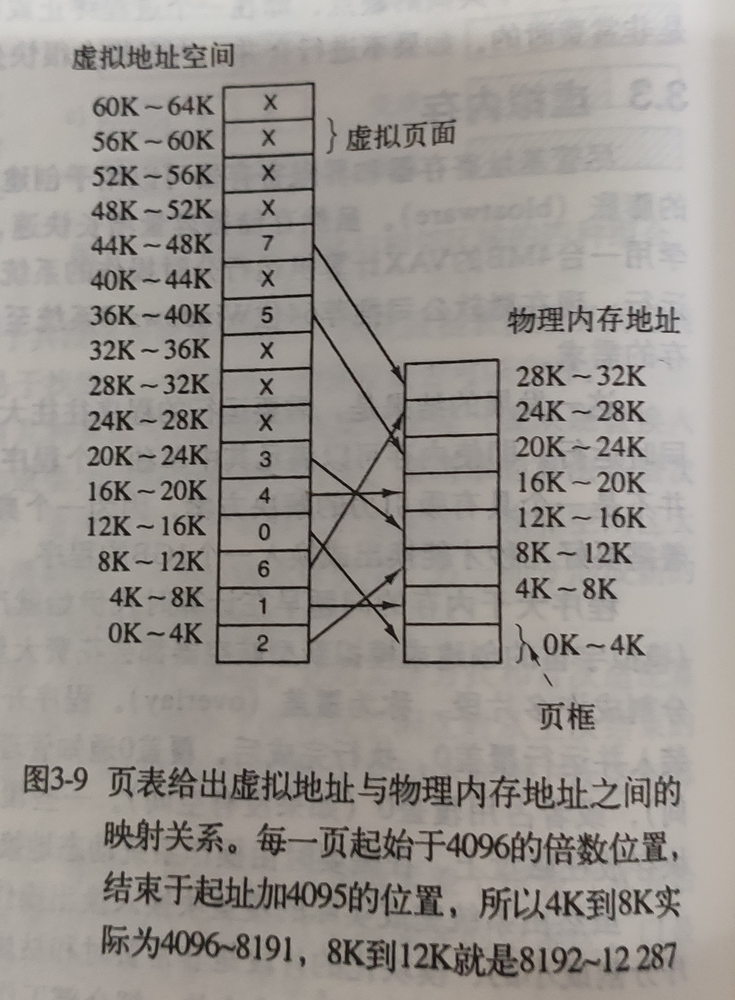
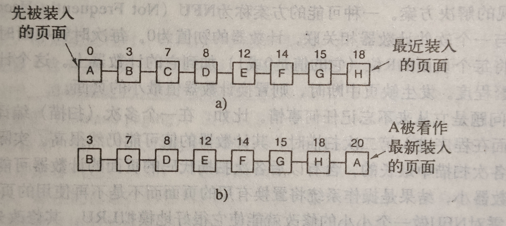
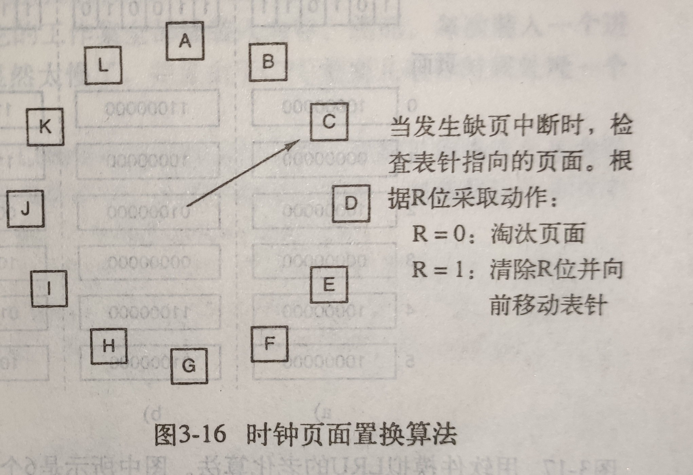

## 物理内存
## 虚拟内存
- 虚拟内存的基本思想是：每个程序拥有自己的地址空间，这个空间被分割成多个块，每一块称作一页，每一页有连续的地址范围。这些页被映射到物理内存，但不是所有页都必须在内存中才能运行。当程序引用到一部分在物理内存中的地址空间时，由硬件立刻执行必要的映射，当程序引用到一部分不在物理内存中的地址时，由操作系统负责将缺失的部分装入物理内存并重新执行失败的命令。
## 分页
- 将地址空间划分为固定大小的页，每页与内存映射。
## 分段
- 将表分成段，一个段构成一个独立的地址空间，段的长度可以动态增长。
## 页面置换算法
- ### 最优页面置换算法
  - 置换最长时间不会访问的页面。但算法无法实现，因为无法预测下一次访问的页面。
- ### 最近未使用
  - NRU（Not Recently Used）使用R与M位构造算法。发生缺页中断时，系统检查页面的R位和M位，把他们分为四类：
    - 第0类：没有被访问，没有被修改。
    - 第1类：没有被访问，已被修改。
    - 第2类：已被访问，没有被修改。
    - 第3类：已被访问，已被修改。
  - 算法随机从最小的非空类中挑出一个页面淘汰。
  - 算法隐含的意思为：淘汰一个没有被访问的已修改页面比淘汰一个经常访问的“干净”页面好。
- ### 先进先出
  - 系统维护一个在内存中的页面的链表，最新进入的页面放在表尾，最早进入的在表头，发生缺页中断时，淘汰表头的页面并把新加入的页面放到表尾。因为可能淘汰经常使用的页面，所以很少使用此算法。
- ### 第二次机会
  - 先进先出算法容易淘汰经常使用的页面，因此进行改进：检查最老页面的R位，如果R位是0，说明页面既老又没有被使用，直接置换；如果是1，则将R位变为0，放到链表尾端，同时修改时间，就像刚进入一样。
- ### 时钟页面置换
  - 第二次机会算法需要经常在表中移动页面，更好的办法是将所有页面保存在一个类似钟面的环形链表中，一个表针指向最老的页面。缺页中断时，首先检查表针指向页面，R位为0直接淘汰，R位为1则置0并把表针前移一个位置。
- ### 最近最少使用(LRU)
  - 发生缺页中断时，首先置换最长时间未使用的页面。
  - [Leetcode.146. LRU 缓存机制](https://leetcode-cn.com/problems/lru-cache/)
  - #### C++实现
    ```C++
    //智能指针实现
    class LRUCache {
    public:
      //结点定义
        struct node {
        //指向下一个结点
            shared_ptr<node> next;
        //指向前一个结点
            weak_ptr<node> pre;
        //记录key
            int key;
        //记录value
            int val;

            node() : key(0), val(0) {}
            node(const int& _key, const int& _val) : key(_key), val(_val) {}
        };

      //一张记录key到链表结点的哈希表，用以实现O(1)复杂度查找
        unordered_map<int, shared_ptr<node>> rec;
      //头指针
        shared_ptr<node> head;
      //尾指针
        shared_ptr<node> tail;
      //容量
        int cap;
      //构造函数
        LRUCache(int capacity) {
            this->cap = capacity;
            this->head = make_shared<node>();
            this->tail = make_shared<node>();
            this->head->next = this->tail;
            this->tail->pre = this->head;
        }

        int get(int key) {
        //如果没有，返回-1
            if (!rec.count(key)) {
                return -1;
            }
        //如果有，先把这个结点放回头部位置，再返回找到的值
            toHead(rec[key]);
            return rec[key]->val;
        }

        void put(int key, int value) {
        //如果已经有这个值了，更新value，然后放回头部位置
            if (rec.count(key)) {
                rec[key]->val = value;
                toHead(rec[key]);
            } else if (rec.size() == cap) {   
          //如果已经满容量，删除哈希表记录的最后一个结点
                rec.erase(tail->pre.lock()->key);
          //同时在链表中也删除这个结点
                removeNode(tail->pre.lock());
          //再添加新节点到头部
                addToHead(make_shared<node>(key, value));
          //同时用哈希表记录位置
                rec[key] = head->next;
            } else {
          //容量没满，也没有这个key，直接添加，然后哈希表记录位置
                addToHead(make_shared<node>(key, value));
                rec[key] = head->next;
            }
        }

      //移动到头部的逻辑
        void toHead(shared_ptr<node>& ptr) {
        //让此结点的下一个结点指向前一个结点的指针指向此节点的前一个结点
            ptr->next->pre = ptr->pre;
        //让此节点的前一个结点的指向下一个结点的指针指向此节点的下一个结点
            ptr->pre.lock()->next = ptr->next;
        //让此节点的指向下一个结点的指针指向头节点的下一个指针
            ptr->next = head->next;
        //头节点的下一个结点的指向前一个结点的指针指向此节点
            head->next->pre = ptr;
        //头节点的指向下一个结点的指针指向此节点
            head->next = ptr;
        //此节点的指向前一个结点的指针指向头节点
            ptr->pre = head;
        }

      //添加到头部的逻辑
        void addToHead(shared_ptr<node>&& ptr) {
        //让此节点的指向下一个结点的指针指向头节点的下一个指针
            ptr->next = head->next;
        //头节点的下一个结点的指向前一个结点的指针指向此节点
            head->next->pre = ptr;
        //头节点的指向下一个结点的指针指向此节点
            head->next = ptr;
        //此节点的指向前一个结点的指针指向头节点
            ptr->pre = head;
        }

      //移除一个节点的逻辑
        void removeNode(shared_ptr<node>&& ptr) {
        //让此节点的前一个结点指向下一个结点的指针指向此节点的下一个结点
            ptr->pre.lock()->next = ptr->next;
        //让此节点的下一个节点的指向前一个结点的指针指向此节点的前一个结点
            ptr->next->pre = ptr->pre;
        }
    };
    ```
- ### 最近最久未使用(LFU)
  - 首先置换最近使用频率最少的页面，如果使用频率相同，则置换最久未使用的页面。
  - [Leetcode.460. LFU 缓存](https://leetcode-cn.com/problems/lfu-cache/)
  - #### C++实现
    ```C++
    class LFUCache {
    private:
      struct node {
        int key;
        int fre;
        int val;
        node(int _key, int _fre, int _val) : key(_key), fre(_fre), val(_val) {}
      };
      int minfre;
      int cap;
      unordered_map<int, list<node>::iterator> keys;
      unordered_map<int, list<node>> freq;
    public:
      LFUCache(int capacity) {
        this->cap = capacity;
        this->minfre = 0;
      }

      int get(int key) {
        if (this->cap == 0 || !keys.count(key)) {
          return -1;
        }

        auto temp = keys[key];
        int tempVal = temp->val;
        int tempFre = temp->fre;

        freq[tempFre].erase(temp);

        if (freq[tempFre].size() == 0) {
          freq.erase(tempFre);
          if (this->minfre == tempFre) {
            this->minfre++;
          }
        }

        freq[tempFre + 1].emplace_front(node(key, tempFre + 1, tempVal));
        keys[key] = freq[tempFre + 1].begin();
        return tempVal;
      }

      void put(int key, int value) {
        if (this->cap == 0) {
          return;
        }
        if (!keys.count(key)) {
          if (keys.size() == cap) {
            auto its = freq[minfre].back();
            keys.erase(its.key);
            freq[minfre].pop_back();
            if (freq[minfre].size() == 0) {
              freq.erase(minfre);
            }
          }
          freq[1].emplace_front(node(key, 1, value));
          keys[key] = freq[1].begin();
          minfre = 1;
        }
        else {
          auto temp = keys[key];
          int tempFre = temp->fre;

          freq[tempFre].erase(temp);
          if (freq[tempFre].size() == 0) {
            freq.erase(tempFre);
            if (minfre == tempFre) {
              minfre += 1;
            }
          }
          freq[tempFre + 1].emplace_front(node(key, tempFre + 1, value));
          keys[key] = freq[tempFre + 1].begin();
        }
      }
    };
    ```