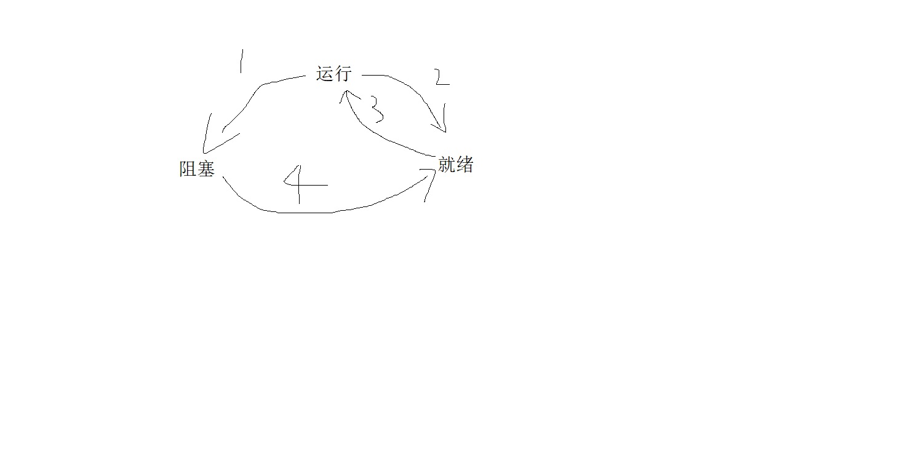

# 进程与线程
- ## 进程
计算机上所有可运行的软件，通常也包括操作系统，被组织成若干顺序进程，一个进程就是一个正在执行程序的实例。**进程是资源分配的基本单位**。  进程拥有三种状态，分别是：
> ### 运行态：该时刻进程实际占用CPU。
> ### 就绪态：可运行，但因为其它进程正在允许而暂时停止。
> ### 阻塞态：除非某种外部事件发生，否则进程不能运行。

- ## 线程
也被称为迷你进程，**是处理器调度和执行的基本单位**。一个进程可以有多个线程且至少有一个线程。一个进程中的线程共享进程的资源。
- ## 进程和线程的区别
  - #### 线程是调度和执行的基本单位，进程是资源分配的基本单位
  - #### 线程不拥有资源，但线程可以访问进程的资源
  - #### 每个进程拥有自己的资源，进程切换开销大，线程切换开销小。
# 进程间通信
- ## 临界区
对临界资源进行访问的程序片段被称为临界区。
- ## 同步、异步、互斥
同步：进程因为相互制约，按顺序先后执行。   
异步：进程不用等待其它进程的消息，只需要自己往后执行  
互斥：多个进程同一时刻只有一个可以得到这个资源。
- ## 互斥量
互斥量是一个拥有两种状态的变量,分别为**加锁状态**和**解锁状态**，当加锁时，其它线程不能进入临界区，只有解锁时其它线程才能进入。
- ## 信号量(1)
  - 信号量使用一个整型变量来进行down和up操作，如果是down操作，则检查是否大于0，如果大于就减一，然后继续；如果等于0就睡眠然后等待其值大于0。如果是up操作就加一，让一个正在睡眠的进程完成down操作，这样就少了一个睡眠的进程。
  - [生产者——消费者问题（Producer-consumer problem）](https://zh.wikipedia.org/wiki/%E7%94%9F%E4%BA%A7%E8%80%85%E6%B6%88%E8%B4%B9%E8%80%85%E9%97%AE%E9%A2%98)  
  生产者不停生产物品，放入缓冲区，消费者不停从缓冲区中拿走物品消耗。当缓冲区满时生产者不会再放入物品，当缓冲区空时消费者也不会再拿走物品。  
  [Golang案例：](../GO/练习.md)
- ## 消息队列(2)
- ## 无名管道(3)
只适用于父子进程之间通信且只能单向传输。
- ## 有名管道(4)
有自己的名字和访问权限的限制，可以用于不相关进程间的通信，进程通过使用管道的名字获得管道。
- ## 共享内存(5)
允许多个进程共享一片给定空间。
- ## 信号(6)
- ## 套接字(7)
# 调度
- ## 批处理系统
    - ### 先来先服务First-come First-served（FCFS）：按照请求的顺序调度
    - ### 短作业优先Shortest job first（SJF）：按估计运行时间最短的顺序调度
    - ### 最短剩余时间优先shortest remaining time next（SRTN）：按剩余运行时间顺序调度
- ## 交互式系统
  - ### 轮转调度
  - ### 优先级调度
  - ### 多级队列
# 经典IPC问题
- ## 哲学家进餐问题
- ## 读-写者问题