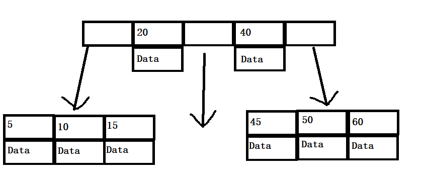
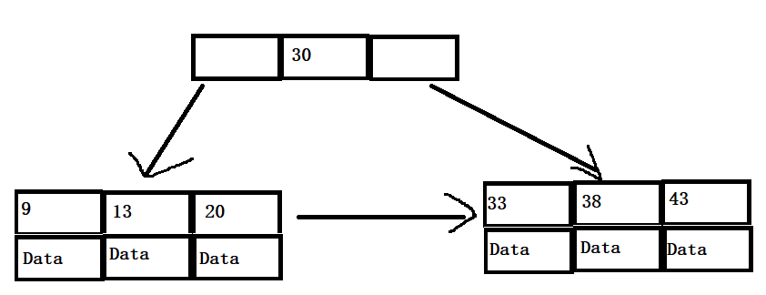

# 数据类型
- ## 数值类型
| 类型 | 大小 |
| :----: | :----: |
| TINYINT | 8位 |
| SMALLINT | 16位 |
| MEDIUMINT	 | 24位 |
| INT | 32位 |
| BIGINT | 64位 |
| FLOAT | 32位 |
| DOUBLE | 64位 |
| DECIMAL | 指定 |
- ## 字符串类型
| 类型 | 用途 |
| :----: | :----: |
| CHAR | 存储定长字符串 |
| VARCHAR | 存储变长字符串 |
| TEXT | 存储长文本数据 |
- ## 日期和时间类型
| 类型 | 大小 | 格式 |
| :----: | :----: | :----: |
| DATE | 3字节 | 2021-03-29 |
| TIME | 3字节 | 3:52:36(持续时间) |
| DATETIME | 8字节 | 2021-03-29 15:50:28 |
# 索引
- ## B树与B+树
  - B 树是平衡树，它的每个结点都存储 key 和 data。
  - B+ 树除叶子结点外的结点只存储 key，只有叶子节点存储 data，且每个叶子节点还有指向相邻叶子节点的指针。B 树与 B+ 树结点的 key 都是升序排列。
  - 因为结点多，所以相对红黑树来说高度更低。
  - **B树:** 
  - **B+树:** 
- ## MySQL 索引
  - 在中大型表中，索引可以大大减少需要扫描的行数。
  - InnoDB 使用 B+ 树作为索引类型，对主键建立**聚簇索引**，聚簇索引叶子节点包含有全部行信息，一张表只能有一个聚簇索引。
  - 非主键索引的叶子节点包含的是一行的主键，所以需要先找到主键值，再到聚簇索引找行信息。
  - 主键索引：定义主键会自动创建主键索引
  - 唯一索引：数据列不能重复，每个唯一索引只能有一列，一张表可以有多个唯一索引
  - 哈希索引：因为只能精确查询，不支持范围查询所以不适合。
  - 普通索引
  - 全文索引
- ## 索引操作
  - #### 查看索引
    ```sql
    SHOW INDEX FROM <表名>
    ```
  - #### 创建索引
    ```sql
    -- 方括号的为可选字段，默认升序
    CREATE INDEX <索引名> ON <表名> (<列名> [<长度>] [ASC | DESC])
    ```
  - #### 删除索引
    ```sql
    DROP INDEX <索引名> ON <表名>
    ```
# 查询优化
- 限定数据范围
- 读写分离，主库负责写，从库负责读。
- 切分大查询，大查询一次会锁住很多数据，造成资源耗费。
# 存储引擎
- ## InnoDB
  - 支持事务
  - 默认隔离级别是可重复读
  - 主索引是聚簇索引，效率高
  - 支持行级锁
  - 支持外键
- ## MyISAM
  - 不支持事务
  - 使用非聚簇索引
  - 支持在线热备份
  - 只能对整张表加锁，不支持行级锁
# 主从复制
- 主数据库用来记录数据，当主数据库故障时可以切换到从数据库，避免服务中断数据丢失，提升了系统的可用性。
- **原理**：主数据库保存一个 bin-log 文件，记录 sql 语句，在从数据库 relay log 中执行这些 sql 语句即可。
# 读写分离
- 在读的需求远大于写需求时使用读写分离
- 主数据库负责写，从数据库负责读
- 优点：分摊主数据库压力，提高并发量
# 切分
- ## 水平切分
  - 将一个表按行切分到多个表中
- ## 垂直切分
  - 将一个表按列切分到多个表中
# 索引失效
- 查询时类型不一致导致失效，查询时尽量避免隐式类型转换
- 函数导致索引失效
- 运算符导致索引失效
- or 运算没有连接同一个字段，索引会失效
- % 在右边时可以走索引，在左边和在两边不走索引
- #### 最左前缀原则
  - 对于**联合索引**，会一直向右匹配，直到遇到索引失效，其右边的所有查询都不走索引，左边的查询仍然走索引。
***
# 参考
- #### [MySQL 教程 | 菜鸟教程](https://www.runoob.com/mysql/mysql-tutorial.html)
- #### [MySQL](https://github.com/CyC2018/CS-Notes/blob/master/notes/MySQL.md)
- #### [MySQL 索引](http://c.biancheng.net/view/7890.html)
- #### [数据库的分库分表、读写分离和主从复制](https://www.jianshu.com/p/386db6246525)