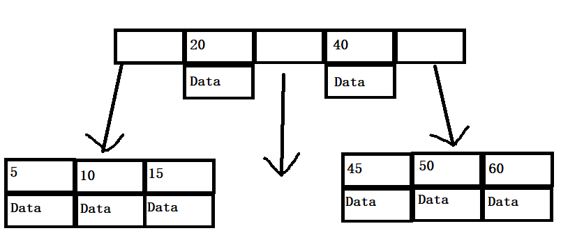
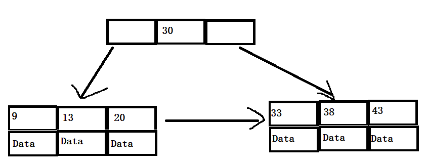

## B树与B+树
- B树是平衡树，它的每个结点都存储key和data，
- B+树除叶子结点外的结点只存储key，只有叶子节点存储data，且每个叶子节点还有指向相邻叶子节点的指针。B树与B+树结点的key都是升序排列。
- 因为结点多，所以相对红黑树来说高度更低。
- **B树:** 
- **B+树:** 
## MySQL索引
- 在中大型表中，索引可以大大减少需要扫描的行数。
- InnoDB使用B+树作为索引类型，对主键建立**聚簇索引**，主键的聚簇索引叶子节点包含有全部行信息
- 非主键索引的叶子节点包含的是一行的主键，所以需要先找到主键索引，再找行信息。
- 哈希索引：因为只能精确查询，不支持范围查询所以不适合。
- 全文索引
## 索引优化
- 