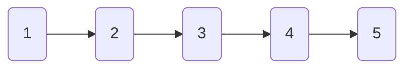
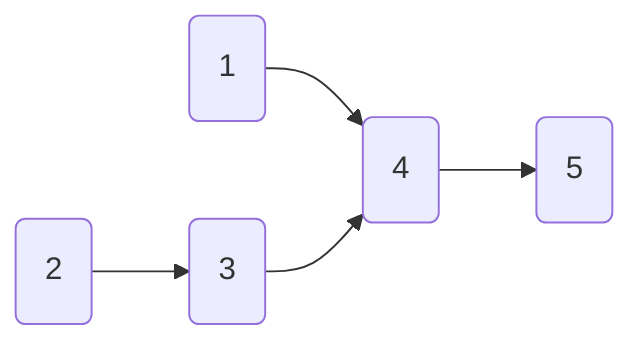
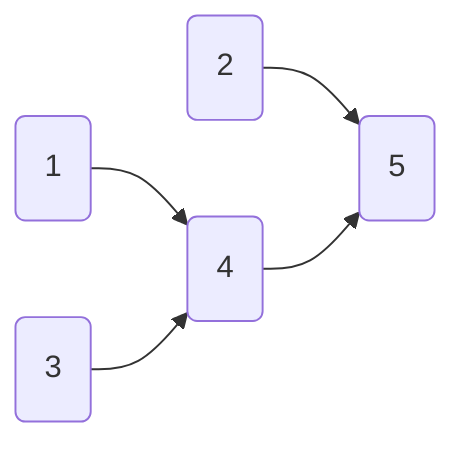
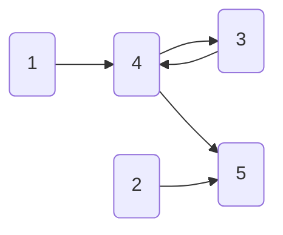
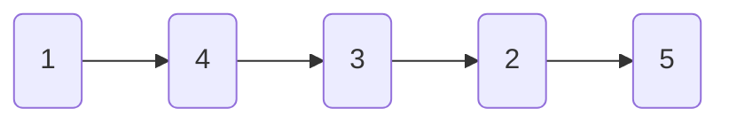

## [Leetcode.92.反转链表 II](https://leetcode-cn.com/problems/reverse-linked-list-ii/)

按下图方式重新连接链表
- **初始链表**

- **让1连接4**

- **让2连接5**

- **然后开始反转234号位置，让4连接3**

- **让3连接2，然后断开4到5的连接**


```C++
/**
 * Definition for singly-linked list.
 * struct ListNode {
 *     int val;
 *     ListNode *next;
 *     ListNode() : val(0), next(nullptr) {}
 *     ListNode(int x) : val(x), next(nullptr) {}
 *     ListNode(int x, ListNode *next) : val(x), next(next) {}
 * };
 */
class Solution {
public:
    ListNode* reverseBetween(ListNode* head, int left, int right) {
        //考虑几种特殊情况，链表为空或者不翻转，直接返回
        if (head == nullptr)
        {
            return nullptr;
        }
        else if (right - left == 0)
        {
            return head;
        }
        ListNode* cur = head;
        ListNode* rec1 = nullptr;
        ListNode* rec2 = head;
        int n = right - left;
        while (left > 1)
        {
            rec1 = cur;
            cur = cur->next;
            rec2 = cur;
            left--;
        }
        ListNode* rec3 = nullptr;
        ListNode* dummyhead = new ListNode(-1, cur);
        while (n)
        {
            cur = cur->next;
            rec3 = cur->next;
            auto temp = new ListNode(cur->val, dummyhead->next);
            dummyhead->next = temp;
            n--;
        }
        rec2->next = rec3;
        //特殊情况，从第一个结点开始翻转，则不用连接rec1所记录的结点
        if (rec1 == nullptr)
        {
            return dummyhead->next;
        }
        rec1->next = dummyhead->next;
        return head;
    }
};
```