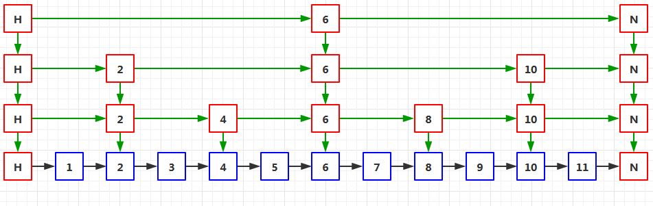

# 数据类型
- ### STRING
  - Key - Value 型数据
- HASH
  - 以键值对存储的无序列表
- LIST
  - 链表型结构，可以从两端插入数据
- SET
  - 无序集合，会自动去除重复数据
- ZSET
  - 有序集合，相比 SET 存储的数据是有序的
# 语法
- ## STRING
| 命令 | 作用 |
| :--: | :--: |
| SET key value | 设定指定 key 对应的 value |
| GET key | 获得指定 key 对应的值 |
| GETRANGE key start end | 获得字符串从 start 到 end 区间子字符串 |
| MGET key1 key2 | 获得多个 key 对应的值 |
| MSET key1 value1 key2 value2 | 设置多个 key 和 value |
| SETEX key seconds value | 设置 key 的值为 value，并将 key 的过期时间设为 seconds |
| SETNX key value | 只有在 key 不存在时设置 key 的值为 value |
| STRLEN key | 获得 key 对应值（字符串）的长度 |
| APPEND key value | 如果 key 已存在，将 value 追加到原来的 value 上 |
  - 示例：
  > set name 张三  
  OK  

  > get name  
  张三  

  > del name  
  1  

  > get name  
  null

- ## LIST
| 命令 | 作用 |
| :--: | :--: |
| BLPOP key1 key2 timeout | 移除并获取列表的第一个元素，如果没有则等待超时或发现可移除元素 |
| BRPOP key1 key2 timeout | 移除并获取列表的最后一个元素，如果没有则等待超时或发现可移除元素 |
| LINDEX key index | 获得 index 下标处的元素 |
| LLEN key | 获得列表长度 |
| LPOP key | 从左侧移除元素 |
| RPOP key | 从右侧移除元素 |
| LPUSH key value1 value2 | 从左侧插入多个元素 |
| RPUSH key value1 value2 | 从右侧插入多个元素 |
| LRANGE key start end | 获得从 start 到 end 范围的元素，如果范围是 0 -1 则是全部元素 |
| LSET key index value | 通过索引设置元素的值 |
| LTRIM key start end | 只保留从 start 到 end 范围的值，其它部分移除 |
  - 示例
  > rpush TestKey name1  
  1  

  > rpush TestKey name2  
  2  

  > lrange TestKey 0 -1  
  name1  
  name2  

  > lpush TestKey name3  
  3  

  > lrange TestKey 0 -1  
  name3  
  name1  
  name2  

  > rpop TestKey  
  name2  

  > lrange TestKey 0 -1  
  name3  
  name1  

  > lpop TestKey  
  name3  

  > lrange TestKey 0 -1  
  name1  

  > llen TestKey  
  1  

  > Lindex TestKey 0  
  name1  

- ## HASH
| 命令 | 作用 |
| :--: | :--: |
| HDEL key field1 field2 | 删除多个字段 |
| HEXISTS key field | 查看指定字段是否存在 |
| HGET key field | 获得指定字段的值 |
| HGETALL key | 获得 key 的所有字段和值 |
| HKEYS key | 获得指定 key 的所有字段 |
| HVALS key | 获得指定 key 的所有值 |
| HLEN key | 获得指定 key 所有字段的数量 |
| HMGET key field1 field2 | 获取所有给定字段的值 |
| HMSET key field1 value1 field2 value2 | 设置多个 key value |
| HSET key field value | 设置指定字段的值 |
| HSETNX key field value | 如果字段不存在才设置值 |
  - 示例
  > hset test name1 张三  
  1

  > hmset test name2 李四 name3 王五 name4 114514 name5 老八  
  OK

  > hgetall test  
  name1  
  张三  
  name2  
  李四  
  name3  
  王五  
  name4  
  114514  
  name5  
  老八 

  > hdel test name1  
  1

  > hget test name1  
  null

  > hget test name2  
  李四

  > hkeys test  
  name2  
  name3  
  name4  
  name5 

  > hlen test  
  4 

  > hvals test  
  李四  
  王五  
  114514  
  老八  
  
- ## SET
| 命令 | 作用 |
| :--: | :--: |
| SADD key member1 member2 | 添加多个成员 |
| SCARD key | 获得集合的成员数 |
| SDIFF key1 key2 | 返回 key1 和 其它给定集合 的差异 |
| SDIFFSTORE destination key1 key2 | 返回所有给定集合的差异并存储在 destination 中 |
| SINTER key1 key2 | 返回所有给定集合的交集 |
| SINTERSTORE destination key1 key2 | 返回所有给定集合的交集并存储在 destination 中 |
| SUNION key1 key2 | 返回给定集合的并集 |
| SUNIONSTORE destination key1 key2 | 返回所有给定集合的并集并存储在 destination 中 |
| SISMEMBER key member | 判断 member 是否是 key 的成员 |
| SMEMBERS key | 返回集合中所有成员 |
| SMOVE source destination member | 将 member 从 source 移动到 destination |
| SPOP key | 移除并返回集合中的一个随机成员 |
| SREM key member1 member2 | 移除多个成员 |
| SRANDMEMBER key count | 返回集合中多个随机数 |
  - 示例
> sadd name 野兽先辈 Deep♂Dark♂Fantacy  
2

> smembers name  
Deep♂Dark♂Fantacy  
野兽先辈

> spop name  
野兽先辈

> sadd name 野兽先辈 Deep♂Dark♂Fantacy  
2

> smembers name  
Deep♂Dark♂Fantacy  
野兽先辈

> spop name  
野兽先辈

> sadd name1 老八秘制小汉堡 野兽 先辈 野兽先辈  
4

> sdiff name name1  
Deep♂Dark♂Fantacy

> sdiff name1 name  
先辈  
野兽  
野兽先辈  
老八秘制小汉堡

- ## ZSET
| 命令 | 作用 |
| :--: | :--: |
| ZADD key score1 member1 score2 member2 | 向有序集合添加多个成员 |
| ZCARD key | 获取有序集合的成员数 |
| ZCOUNT key min max | 计算指定区间分数的成员数 |
| ZINTERSTORE destination key1 key2 | 计算多个集合交集并存储在 destination 中 |
| ZUNIONSTORE destination numkeys key1 key2 | 计算多个集合并集，存储在 destination 中 |
| ZLEXCOUNT key min max | 计算指定区间成员数量 |
| ZRANGE key start stop | 通过索引区间返回指定区间成员 |
| ZRANGEBYLEX key min max | 通过字典区间返回指定成员 |
| ZRANGEBYSCORE key min max | 通过分数返回指定区间成员 |
| ZRANK key member | 返回集合中指定成员索引 |
| ZREM key member1 member2 | 移除集合中一个或多个成员 |
| ZREMRANGEBYLEX key min max | 移除集合中给定字典区间所有成员 |
| ZREMRANGEBYRANK key start stop | 移除给定排名区间所有成员 |
| ZREMRANGEBYSCORE key min max | 移除集合中给定分数区间所有成员 |
| ZREVRANGE key start stop | 通过索引返回指定区间成员，分数从高到低 |
| ZREVRANGEBYSCORE key max min | 返回集合中指定分数区间成员，分数从高到低 |
| ZREVRANK key member | 返回集合中指定成员的排名，按分数从大到小排 |
| ZSCORE key member | 返回成员分数值 |
  - 示例
> zadd age 18 路人甲 20 龙套乙  
2

> zscore age 路人甲  
18

> zrevrank age 路人甲  
1

> zrevrank age 龙套乙  
0

> zrange age 0 -1  
路人甲  
龙套乙

# 持久化
- ## 什么是持久化
  - 将数据放在断电后不会丢失的设备中。
- ## RDB
  - Redis 默认的持久化方式，在指定的时间间隔内将内存中数据持久化到硬盘中。
  - **save 命令**：阻塞当前进程，直到 RDB 完成。
  - **bgsave 命令**：主进程会 fork 一个子进程完成保存，阻塞时间短。
  - 优点：
    - RDB 加载速度快，定时备份。
  - 缺点：
    - 丢失数据按分钟计，不适用于实时性要求高的场景
- ## AOF
  - 记录下之前所有的写指令，在下次启动时再次执行一遍这些指令。
  - AOF 重写：数据量会一直增加，定期重写可以减少无用数据增加。每次遍历所有数据，加入文件中。
  - 优点
    - 性能影响小
  - 缺点：
    - 加载速度慢
    - 文件体积大
# 哨兵
- 哨兵是一个独立的进程，用来检测 Redis 主从服务器是否正常运行
# 集群
# 跳表
- 是有序集合的底层实现，跳表由多个有序链表组成，从上到下每级链表节点数量依次递减。（图片来源于网络）
- 查找时，从上层链表开始查找，找到区间后再到下级链表查询
- **跳表优点**
  - 插入速度快
  - 数据结构容易理解，相对容易实现
# 过期时间与淘汰策略
- ## Redis 有六种淘汰策略
| 淘汰策略 | 描述 |
| :-: | :-: |
| volatile-lru | 从已设置过期时间的数据中删除**最近最少使用**的 |
| volatile-ttl | 从已设置过期时间的数据中删除即将过期的 |
| volatile-random | 从已设置过期时间的数据中随即删除 |
| allkeys-lru | 从所有数据中删除**最近最少使用**的 |
| allkeys-random | 从所有数据中随机选择删除 |
| no-enviction | 禁止删除任何数据 |
# 缓存问题
- ## 缓存雪崩
  - 同一时间正好有大批数据同时失效，传来的请求直接打在数据库上，造成数据库承担过大压力。
  - **解决方法：**
    - 过期时间进行随机化调整，避免大量 Key 同时过期
    - 访问量过大时限流，避免同时请求过多
- ## 缓存穿透
  - 攻击者刻意大量去请求不存在的数据，造成缓存像是不存在一样，所有请求直接打在数据库上，造成数据库压力过大。
  - **解决方法：**
    - 存储无效 Key 设为NULL，下次查询时直接返回
    - 使用布隆过滤器
- ## 缓存击穿
  - 大量请求访问一个热点 Key 时，Key 突然失效，大量请求直接打在数据库上，造成数据库压力过大。
  - **解决方法：**
    - 延长热点 Key 过期时间或者不设置过期时间
# 常见问题
- ## 为什么 Redis 这么快？
  - Redis 基于内存操作，数据存放在内存中
  - 非阻塞 I/O，采用 epoll
  - 单线程避免上下文切换
***
# 参考
- #### [Redis](https://github.com/CyC2018/CS-Notes/blob/master/notes/Redis.md)
- #### [Redis 教程 | 菜鸟教程 - RUNOOB.COM](https://www.runoob.com/redis/redis-tutorial.html)
- #### [Redis的持久化机制](https://zhuanlan.zhihu.com/p/77646963)