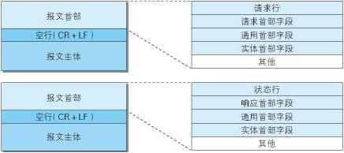

# HTTP 与 I/O
- ### HTTP(HyperText Transfer Protocol
  - 超文本传输协议的缩写，是一种应用广泛的网络传输协议。用户使用Http协议，通过浏览器作为客户端向web服务器发送请求。
  - HTTP是无连接的，指每次连接处理完一个请求后就会断开。
  - HTTP是无状态的，协议对于事务没有记忆，每次连接都是新连接，与上次无关。
- ### HTTP 报文(图片来源于网络)
  
- ### HTTP请求与响应
  - **请求报文**：发送一个http请求包含以下格式：请求行、请求头部、空行和请求数据。  
    **示例**：
    ```
    Accept-Language: zh-CN,zh;q=0.9,en;q=0.8,en-US;q=0.7
    Cookie: JSESSIONID=1F78DFDEDF9EBA5561AABDE63DD158E5; SERVERID=122; JSESSIONID=1AEB986F1EDF83C48AF8BE6BD2D60535
    Host: xxx
    Referer: xxx
    User-Agent: Mozilla/5.0 (Windows NT 10.0; Win64; x64) AppleWebKit/537.36 (KHTML, like Gecko) Chrome/89.0.4389.90 Safari/537.36 Edg/89.0.774.54
    ```
  - **响应报文**：响应报文也分为四个部分：状态行、消息报头、空行和响应正文。  
    **示例**：
    ```
    Cache-Control: no-cache
    Content-Encoding: gzip
    Content-Type: text/html;charset=utf-8
    Date: Thu, 18 Mar 2021 08:46:09 UTC
    Expires: Thu, 01 Jan 1970 00:00:00 GMT
    Pragma: No-cache
    Transfer-Encoding: chunked
    vary: accept-encoding
    x-frame-options: SAMEORIGIN
    ```
- ### URI：统一资源标识符，用来标识一个资源是什么
- ### URL：统一资源定位符，用来定位一个资源，URL 由协议名、域名、端口号组成。例：https://cn.bing.com/
  - #### 输入 URL 到页面加载发生了什么？
    - DNS 解析
      - 先递归查找，然后迭代查找
      - 首先检查浏览器自身的 DNS 缓存、操作系统的缓存、本地 hosts 文件，找到则返回
      - 然后查找本地 DNS 服务器，找到则返回
      - 迭代查找，根服务器告知 IP ，本地 DNS 服务器查找顶级域、二级域、三级域，直到找到。
      - 本地 DNS 找到后返回 IP，然后将其缓存以便下次查找
    - TCP 连接
    - 发送 HTTP 请求，建立连接（三次握手）
    - 服务器处理请求
    - 浏览器渲染页面，构建 DOM 树
    - 断开连接（四次挥手）
- ### 请求方法
  - #### GET：向服务器获取资源
  - #### HEAD：只返回响应头的 GET 请求
  - #### POST：向服务器提交表单数据
  - #### GET 请求和 POST 请求的区别
    - GET 请求将数据放在 URL 中，POST 放在表中。GET 请求无长度限制，只是一般情况下**浏览器**会对 URL 长度作限制导致发送的限制。POST 请求发送数据采用表的形式，GET 请求会将请求头与数据一起发送过去，产生**一个** TCP 数据包，POST 请求会先发送请求头，等待服务器响应后再发送数据，因此产生**两个** TCP 数据包。GET 请求和 POST 请求都不安全，因为 HTTP 是明文传输，想保证安全性要使用 HTTPS。
- ### 常见 HTTP 状态码
    | 状态码 | 描述 |
    | :---: | :---: |
    | 1xx  | 请求正常处理 |
    | 2xx  | 请求成功处理 | 
    | 3xx  | 重定向，需要额外操作 |
    | 4xx  | 客户端错误，服务器无法处理请求 |
    | 5xx  | 服务端处理错误 |
  - **200**：请求成功
  - **206**：客户端进行了范围请求
  - **301**：资源已经被永久转移到新位置
  - **302**：临时重定向
  - **403**：请求被拒绝
  - **404**：请求URL不存在
  - **500**：服务器错误
  - **503**：服务器现在无法处理请求
- ### 短连接与长连接
  - HTTP 1.1 开始默认为长连接，断开连接使用 Connection：close。
  - HTTP1.1 之前的使用 Keep-Alive 保持长连接。
  - 长连接可以只用一次 TCP 连接进行多次通信。
  - HTTP 长连接本质上是 TCP 长连接。在 TCP 保持连接期间需要发送心跳包（数据包）检测双方通信是否正常以维持长连接。
- ### HTTP 与 HTTPS 的区别
  - #### HTTPS 是超文本传输安全协议，在 HTTP 基础上加了 SSL 层，SSL 通过加密防止窃听，通过证书防止冒充，通过签名防止篡改。
  - #### HTTPS 在建立连接时使用非对称加密，连接建立后使用对称加密。
  - #### 加密
    - 对称加密：加密和解密使用同一个秘钥。
    - 非对称加密：拥有两个秘钥，公钥和私钥。一方将公钥发给另一方同时自己保留私钥，另一方通过公钥进行加密后只能通过私钥进行解密。常见的非对称加密算法为 **RSA 算法**。
  - #### HTTPS 工作流程
    - 客户端发起 HTTPS 请求
    - 服务端向客户端发送证书和公钥（非对称加密）
    - 客户端验证服务端证书是否有效
    - 客户端发送用公钥加密后的会话密钥（用以后续对称加密）
    - 服务端用私钥解密客户端的数据
    - 服务端发送用会话秘钥加密的数据（此时为对称加密）
    - 客户端用会话密钥解密服务端的数据
  - #### HTTP 数据未加密，安全性差，HTTPS 经过 SSL 加密，安全性好。
  - #### HTTP 响应速度快，HTTP 通过三次握手建立连接，需要交换三个数据包，HTTPS 还有 SSL 握手的九个数据包，一共十二个。
  - #### HTTP 使用 80 端口，HTTPS 使用 443 端口。
- ### HTTP 2.0 和 HTTP 3.0
  - **RTT(Round Trip Time)**：通信来回时间，TCP 握手就是 1.5 RTT
  - **HTTP 2.0**：使用了多路复用，通过一个连接发送多条消息
- ### Cookie
  - 因为 HTTP 是无状态的，而 Web 希望能识别用户身份，为此使用了 Cookie。它允许站点对用户进行跟踪。
  - Cookie 可以进行行为跟踪，个性化设置和状态管理等。
  - **Cookie 被禁用?**
    - 将 sessionid 附加在 url 后面
- ### Session
  - **Cookie 和 session 异同**：
    - cookie 和 session 都用来跟踪用户
    - Cookie 用来保存用户信息，session 是通过服务器记录用户状态
    - cookie 保存在客户端，session 保存在服务器端
- ### token
  - 第一次登陆时，服务器将生成的 token 返回给客户端，客户端以后再请求时带上 token 就无需用户名和密码了，这样就减轻了服务器的压力。
- ### 缓存
  - 缓存通常用来缓解服务器压力，更快地读取数据。缓存既可以存在服务端，也可以存在客户端。
- ### 代理
  - #### 正向代理
    - 有时我们访问一些网站，因为某些原因又无法访问，但我们可以向另一个服务器发送请求，再由这个服务器将请求发送到网站并将内容返回给我们，**服务端对代理无感知**，这就是正向代理。
  - #### 反向代理
    - 用户访问网站服务器时，**客户端对代理无感知**，实际是访问了网站的代理服务器，代理服务器再将请求发送给后台的Web服务器处理，并将处理的请求返回给用户，这就是反向代理。
- ## 五种 I/O 模型
  - ### 阻塞式 I/O
    - 在内核复制完所有数据之前进程一直被阻塞等待。
  - ### 非阻塞 I/O
    - 进程不等待复制完成，而是每隔固定时间轮询检查是否完成，如果没有完成则去完成其它任务。
  - ### 信号驱动 I/O
    - 当完成数据复制时，内核给进程发送一个信号通知。进程捕捉到信号开始 I/O。
  - ### I/O 多路复用
    - 一个进程阻塞等待多个套接字的数据，任意套接字可读或可写时进程就可以进行读写。I/O 多路复用可以用更少的资源完成更多的任务。
  - ### 异步 I/O
    - 内核在完成操作后向进程发送信号，通知进程 I/O 完成。
- ## I/O 多路复用
  - ### 无差别轮询
    - 没有套接字准备好时阻塞进程，有任意套接字准备好时遍历所有套接字并处理准备好的 I/O 事件。
  - ### 最小轮询
    - 只处理准备好了的 I/O 事件。
  - ### select
    - 采用无差别轮询，通过 select 阻塞并监视状态变化。
  - ### poll
    - 使用无差别轮询
  - ### epoll
    - 使用最小轮询，与 select 和 poll 相比不限制监视对象的数量，I/O 效率不会因监视数量增多而下降。