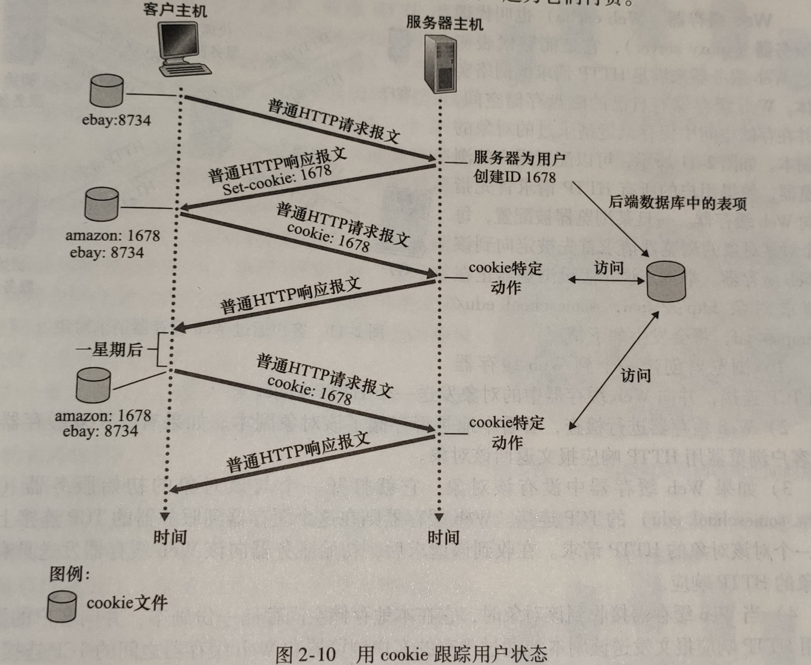

# HTTP
- ### HTTP(HyperText Transfer Protocol
  - 超文本传输协议的缩写，是一种应用广泛的网络传输协议。用户使用Http协议，通过浏览器作为客户端向web服务器发送请求。
  - HTTP是无连接的，指每次连接处理完一个请求后就会断开。
  - HTTP是无状态的，协议对于事务没有记忆，每次连接都是新连接，与上次无关。
- ### HTTP 首部
  - #### 通用首部字段
  - #### 请求首部字段
  - #### 响应首部字段
  - #### 实体首部字段
- ### HTTP请求与响应
  - **请求报文**：发送一个http请求包含以下格式：请求行、请求头部、空行和请求数据。  
    **示例**：
    ```
    Accept-Language: zh-CN,zh;q=0.9,en;q=0.8,en-US;q=0.7
    Cookie: JSESSIONID=1F78DFDEDF9EBA5561AABDE63DD158E5; SERVERID=122; JSESSIONID=1AEB986F1EDF83C48AF8BE6BD2D60535
    Host: xxx
    Referer: xxx
    User-Agent: Mozilla/5.0 (Windows NT 10.0; Win64; x64) AppleWebKit/537.36 (KHTML, like Gecko) Chrome/89.0.4389.90 Safari/537.36 Edg/89.0.774.54
    ```
  - **响应报文**：响应报文也分为四个部分：状态行、消息报头、空行和响应正文。  
    **示例**：
    ```
    Cache-Control: no-cache
    Content-Encoding: gzip
    Content-Type: text/html;charset=utf-8
    Date: Thu, 18 Mar 2021 08:46:09 UTC
    Expires: Thu, 01 Jan 1970 00:00:00 GMT
    Pragma: No-cache
    Transfer-Encoding: chunked
    vary: accept-encoding
    x-frame-options: SAMEORIGIN
    ```
- ### URI：统一资源标识符，用来标识一个资源是什么
- ### URL：统一资源定位符，用来定位一个资源，例：https://cn.bing.com/
  - #### 输入 URL 到页面加载发生了什么？
    - DNS 解析
    - TCP 连接
    - 发送 HTTP 请求
    - 服务器处理请求
    - 浏览器渲染页面
- ### 请求方法
  - #### GET：向服务器获取资源
  - #### HEAD：只返回响应头的 GET 请求
  - #### POST：向服务器提交表单数据
  - #### GET 请求和 POST 请求的区别
    - GET 请求将数据放在 URL 中，POST 放在表中。GET 请求无长度限制，只是一般情况下**浏览器**会对 URL 长度作限制导致发送的限制。POST 请求发送数据采用表的形式，GET 请求会将请求头与数据一起发送过去，产生**一个** TCP 数据包，POST 请求会先发送请求头，等待服务器响应后再发送数据，因此产生**两个** TCP 数据包。GET 请求和 POST 请求都不安全，因为 HTTP 是明文传输，想保证安全性要使用 HTTPS。
- ### 常见 HTTP 状态码
    | 状态码 | 描述 |
    | :---: | :---: |
    | 1xx  | 请求正常处理 |
    | 2xx  | 请求成功处理 | 
    | 3xx  | 重定向，需要额外操作 |
    | 4xx  | 客户端错误，服务器无法处理请求 |
    | 5xx  | 服务端处理错误 |
  - **200**：请求成功
  - **206**：客户端进行了范围请求
  - **301**：资源已经被永久转移到新位置
  - **302**：临时重定向
  - **403**：请求被拒绝
  - **404**：请求URL不存在
  - **500**：服务器错误
  - **503**：服务器现在无法处理请求
- ### 短连接与长连接
  - HTTP 1.1 开始默认为长连接，断开连接使用 Connection：close
  - 之前的使用 Keep-Alive 保持长连接
  - 长连接可以只用一次 TCP 连接进行多次通信
- ### HTTP 与 HTTPS 的区别
  - #### HTTPS 是超文本传输安全协议，使用 HTTP 通信，但是利用 SSL 加密数据包达到安全传输的目的。
  - #### 加密
    - 对称加密：加密和解密使用同一个秘钥
    - 非对称加密：拥有两个秘钥，公钥和私钥。如果使用公钥加密必须使用相应的私钥才能解密；如果使用私钥加密，必须使用相应的公钥才能解密。常见的非对称加密算法为 **RSA 算法**。
  - #### HTTPS 工作流程
    - 客户端发起 HTTPS 请求
    - 客户端验证服务端证书
    - 服务端向客户端发送证书和公钥
    - 客户端发送用公钥加密后的数据
    - 服务端用私钥解密客户端的数据
    - 服务端发送私钥加密后的数据
    - 客户端用公钥解密服务端的数据
  - #### HTTP 数据未加密，安全性差，HTTPS 经过 SSL 加密，安全性好。
  - #### HTTP 响应速度快，HTTP 通过三次握手建立连接，需要交换三个数据包，HTTPS 还有 SSL 握手的九个数据包，一共十二个。
  - #### HTTP 使用 80 端口，HTTPS 使用 443 端口。
- ### Cookie
  - 因为 HTTP 是无状态的，而 Web 希望能识别用户身份，为此使用了 Cookie。它允许站点对用户进行跟踪。
  - Cookie 可以进行行为跟踪，个性化设置和状态管理等。
- ### Session
- ### 缓存
- ### 代理
  - #### 正向代理
    - 有时我们访问一些网站，因为某些原因又无法访问，但我们可以向另一个服务器发送请求，再由这个服务器将请求发送到网站并将内容返回给我们，**服务端对代理无感知**，这就是正向代理。
  - #### 反向代理
    - 用户访问网站服务器时，**客户端对代理无感知**，实际是访问了网站的代理服务器，代理服务器再将请求发送给后台的Web服务器处理，并将处理的请求返回给用户，这就是反向代理。