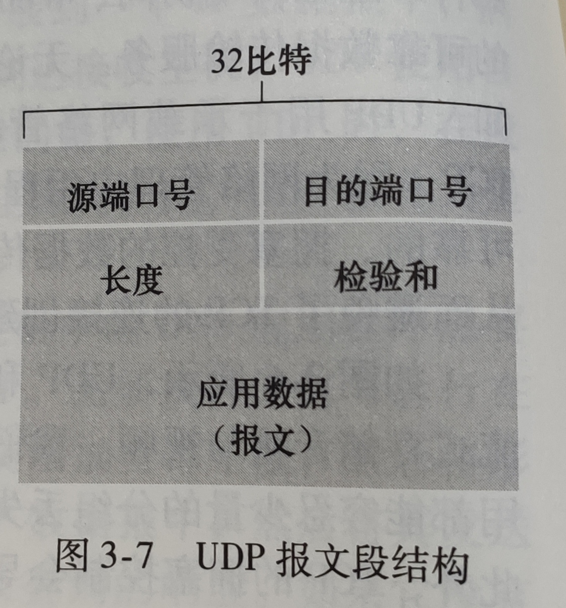
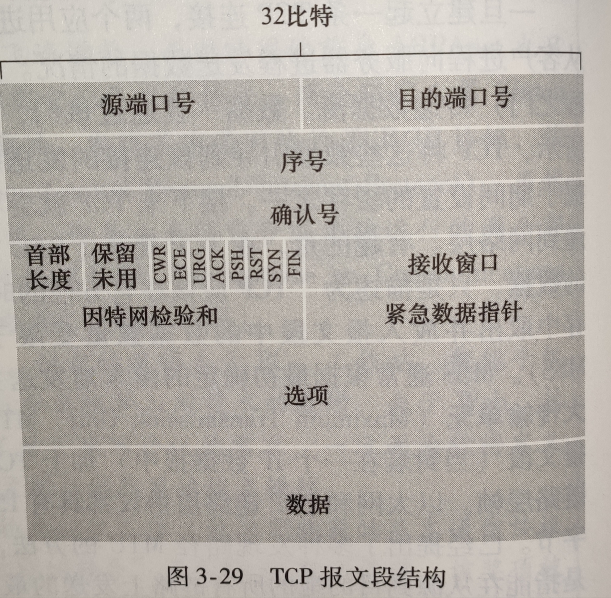
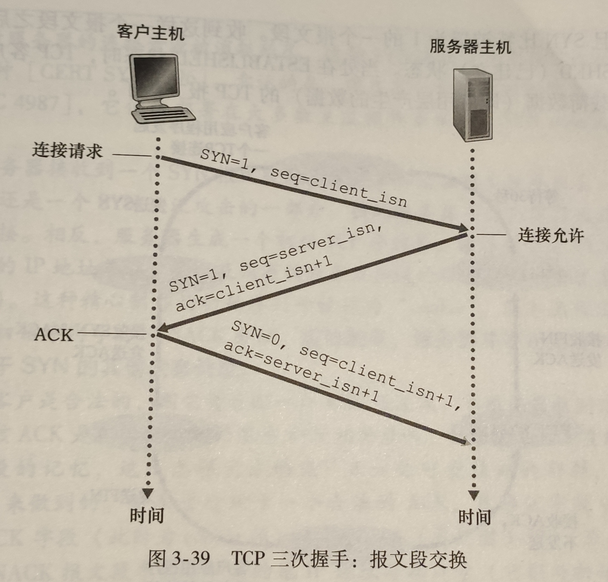
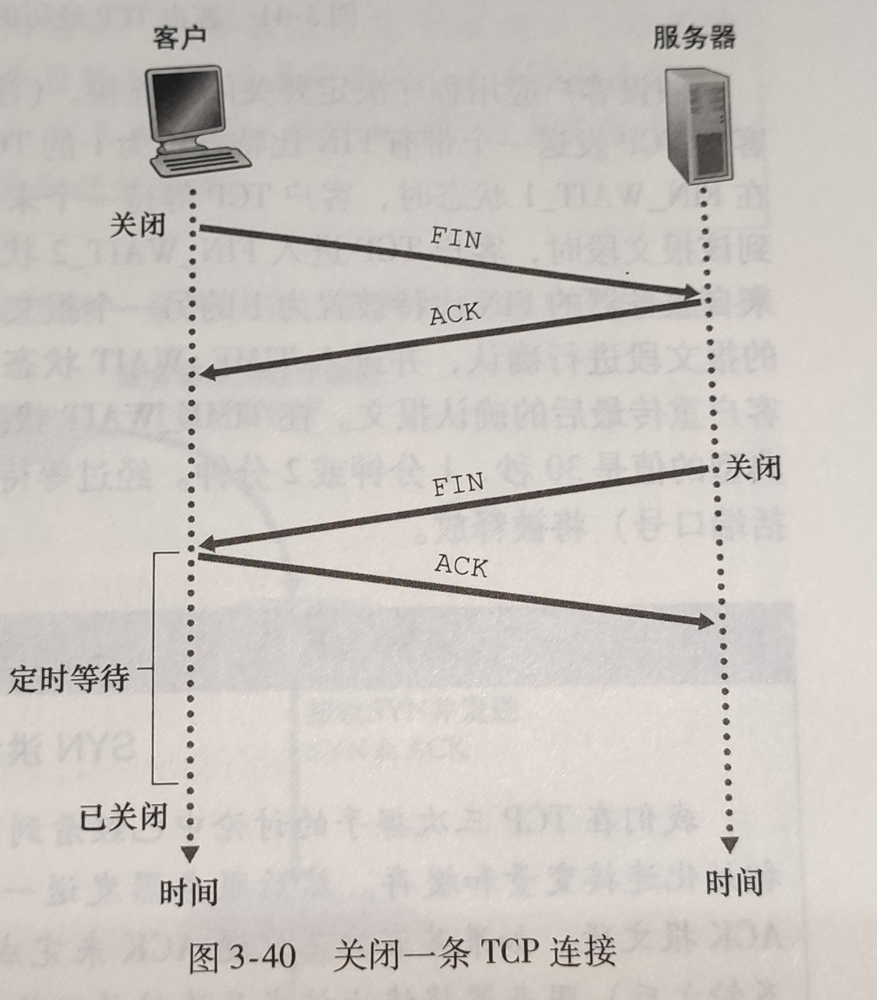

# 传输层
- ## 无连接运输：UDP
  - 用户数据报协议（UDP）是无连接的，**面向报文**，尽最大可能，但不保证交付，支持一对一、一对多、多对一和多对多通信。
  - **特点：**
    - 无须建立连接
    - 无连接状态
    - 分组首部开销小。TCP 报文首部有 20 字节开销，UDP 只有 8 字节。
  - **首部格式：**
  - 
- ## 面向连接的运输：TCP
  - ### 特点：
    - **面向字节流（将应用层的报文视为字节流，把字节流组织为大小不等的数据块）**，面向连接的，提供可靠交付，有流量控制，拥塞控制，提供全双工通信，只能一对一通信。
  - ### 首部格式
    
    - **序号**：用于对字节流编号。(例如一个报文段序号为：0 - 1000)
    - **确认号**：期望收到的下一个报文段的序号
    - **数据偏移**：数据部分距报文段的偏移量，指首部长度。
    - **紧急URG**：URG = 1 时，表明紧急指针字段有效，此数据段有应先发送此高优先级数据。
    - **复位RST**：RST 为 1 时 TCP 出现错误，要重新建立连接。
    - **确认ACK**：当 ACK = 1 时确认号字段有效，否则无效。TCP 规定建立连接后的所有报文段都必须将 ACK 置为 1。
    - **同步SYN**：建立连接时用来同步序号，SYN = 1，ACK = 0 表示是一个请求连接报文段，若对方同意，则变为 SYN = 1，ACK = 1。
    - **终止FIN**：FIN = 1 时表示数据已经传输完毕。
    - **窗口**：窗口值作为接收方让发送方设置发送窗口的依据。
  - ### 三次握手
    
    > 首先服务端处于监听状态，等待连接请求。
    > 客户端向服务端发送连接请求。
    > 服务端收到请求后**知道自己接收正常**，并回复确认报文。
    > 客户端收到确认报文后**知道自己发送正常，接收正常**，并且回复确认报文，让服务端知道自己已经收到。
    > 服务端收到报文，**知道自己发送正常**，连接建立。

    **三次握手原因：**
    > **为什么不是四次握手**：四次握手过程为客户端发送给服务端，服务端回复确认，服务端发送给客户端，客户端回复确认。其中第二步和第三步可以合并以**提高效率**。
    > **为什么不是两次握手**：两次握手过程为客户端发送给服务端，服务端也发送给客户端。这样只有一方的序列号能够被确认，另一方的得不到确认。
    > 因此，要兼顾**效率**和**可靠**，三次最合适。
  - ### 四次挥手
    
    > 客户端发送关闭请求
    > 服务端回复确认报文，此时连接处于半关闭状态，服务端能向客户端发送数据，客户端不能向服务端发送。
    > 服务端向客户端发送关闭请求
    > 客户端收到后回复确认，进入 TIME-WAIT 状态，等待 2MSL（最大报文存活时间）后关闭连接。
    > 服务端收到确认后关闭连接。

    **四次挥手原因：**
    > 客户端发送完 FIN 关闭连接请求后，服务器进入 CLOSE-WAIT 状态，这时服务器可以继续发送未发完的数据。发送完后服务器会发送 FIN 关闭连接请求。

    **TIME-WAIT状态：**
    > 客户端收到服务端的 FIN 后进入 TIME-WAIT 状态，此时还要等待 2 MSL。这样可以确保最后一个报文能够到达，如果没有到达，服务器会重发关闭连接请求。
    同时可以让这个连接持续时间内的所有报文消失，确保下一个连接不会出现旧报文。
    如果只等 1 MSL，检测到报文没有到达就用了 1 MSL，客户端连接就关闭了。
- ## TCP 如何保证可靠传输
  - ### 校验和
  - ### 流量控制
    - #### 滑动窗口
      > 1、窗口用来存放字节流，发送方和接收方各有一个窗口，接收方通过报文告诉发送方自己的窗口大小，发送方再据此调整自己窗口大小。
      > 2、发送窗口内的数据都可以发送，接收窗口内的数据都可以接收。如果发送窗口最左侧数据发送成功，则向右滑动窗口继续发送，接收窗口同理。
      > 3、接收方只对**最后一个按序到达的字节确认**，确认后发送方就知道这个字节之前的字节都已经发送成功。
    - 流量控制可以控制发送方发送频率，接收方可以发送确认报文段来控制发送方窗口大小。这样可以**让接收方来得及接收。**
  - ### 拥塞控制
    - 网络拥堵时分组会丢失，发送方继续发送数据，网络更拥堵。这时通过拥塞控制控制发送方频率。拥塞控制是为了降低网络堵塞。
    - TCP 主要通过四个算法进行拥塞控制：慢开始、拥塞避免、快重传和快恢复。
    - **慢开始与拥塞避免**：设置一个上限，开始时执行慢开始，然后发送方只能发送一个报文段，确认后可以发送两个...每次确认后都加倍。当每次发送的报文段超过上限时，每次不再加倍，而是只多发一个报文段。如果出现超时，使**上限 = 每次发送的报文段 / 2**，然后重新从慢开始执行。
    - **快重传与快恢复**：接收方每次都会发送接收到的最后一个报文的确认，如果发送方收到了三个相同的确认，则知道有报文段丢失。执行快重传，立刻重传确认报文段的下一个报文段。这时不是网络拥塞，所以执行快恢复，直接使**上限 = 每次发送的报文段 / 2**，然后让**每次发送的报文段 = 上限**，直接进入拥塞避免。
  - ### ARQ 协议
  - ### 超时重传机制
- ## 粘包和拆包
  - 如果有多个请求数据量较小，发送时将这多个请求合并为一个请求发送，接收端收到时发现数据包连在了一起，这就是粘包。
  - 如果一个请求的数据量太大，超过缓冲区大小，发送时将会把其拆分成多次发送，这就是拆包。
  - **解决方法**：发送方给数据包添加边界信息，如添加首部，首部含有一些信息。或者将每个数据包设为固定长度等。
  - UDP 没有粘包或拆包问题，因为 UDP 是基于报文发送的，UDP 首部指示了报文长度，因此可以分开。而 TCP 是基于字节流传输的，首部没有表示长度的字段，且TCP将数据看作没有边界的字节流。
- ## TCP 与 UDP 的区别
  - TCP 提供可靠交付，UDP 提供不可靠交付，因此 TCP 需要先建立连接，UDP 不需要。
  - TCP 首段报文需要 20 个字节，UDP 需要 8 个字节。
- ## TCP 与 UDP 适用场景
|  应用  | 应用层协议 | 传输层协议 | 
|  :----:  | :----:  | :----:  |
| 电子邮件 | SMTP | **TCP** |
| 远程终端访问 | Telnet | **TCP** |
| Web | HTTP | **TCP** |
| 文件传输 | FTP | **TCP** |
| 远程文件服务器 | NFS | **通常UDP** |
| 流式多媒体 | 通常专用 | **UDP或TCP** |
| 因特网电话 | 通常专用 | **UDP或TCP** |
| 网络管理 | SNMP | **通常UDP** |
| 名字转换 | DNS | **通常UDP** |
- ## 常用端口号
| 应用 | 应用层协议 | 端口号 | 传输层协议 |
| :-: | :-: | :-: | :-: |
| 域名解析 | DNS | 53 | UDP/TCP |
| 动态主机配置协议|	DHCP | 67/68 | UDP |
| 简单网络管理协议|	SNMP | 161/162 | UDP |
| 文件传送协议| FTP |	20/21 | TCP|
| 远程终端协议|	TELNET | 23 |	TCP	|
| 超文本传送协议|	HTTP |	80 | TCP |
| 简单邮件传送协议|	SMTP | 25 | TCP	|
| 邮件读取协议|	POP3 | 110 | TCP |
| 网际报文存取协议|	IMAP | 143 | TCP |