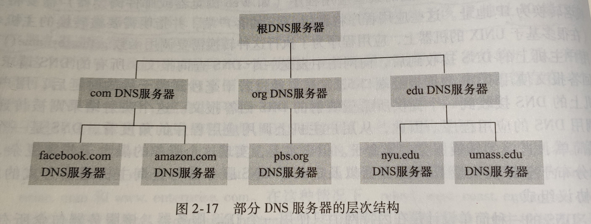

# 应用层
- ## DNS (域名系统)
  - #### 因为 IP 地址不方便记忆，所以出现了域名。
  - #### DNS 通常是由其他应用层协议所使用的，包括 HTTP、SMTP 和 FTP，将用户提供的主机名解析为 IP 地址。
  - #### 用户主机想获得 IP 地址过程如下：
    - 同一台用户主机上运行着 DNS 应用的客户端
    - 浏览器从 URL 中抽取出主机名，并将主机名传给 DNS 应用的客户端
    - DNS 客户端向 DNS 服务器发送一个包含主机名的请求
    - DNS 客户端收到一份回答报文，其中有对应该主机名的 IP 地址
    - 一旦浏览器收到来自 DNS 的该 IP 地址，它能够向位于该 IP 地址 80 端口的服务器发起一个 TCP 连接
  - #### DNS 服务器分为三种
    - **根 DNS 服务器**
    - **顶级域 DNS 服务器**
    - **权威 DNS 服务器**
    - 还有一种 DNS 服务器叫本地 DNS 服务器，严格来说它不属于该服务器的层次结构，本地 DNS 服务器通常与主机相隔不超过几台路由器，当主机发出 DNS 请求时，该请求被发往本地 DNS 服务器，它起着代理的作用，并将该请求转发到 DNS 服务器层次结构中。
  - #### DNS 缓存
    - **原理**：在一个请求链中，当某 DNS 服务器接收一个 DNS 回答时，它能将映射缓存在本地存储器中。
  - #### DNS 记录和报文
    - 共同实现 DNS 分布式数据库的所有 DNS 服务器存储了资源记录，资源记录提供了主机名到 IP 地址的映射。
    - 资源记录是一个包含了下列字段的四元组：（Name，Value，Type，TTL）
    - TTL 是该记录的生存时间，它决定了资源记录应当从缓存删除的时间。
    - DNS 查询报文与回答报文格式：
- ## Web 和 HTTP
- ## 电子邮件协议
  - ### SMTP
  - ### POP3
  - ### IMAP
- ## FTP (文件传输协议)