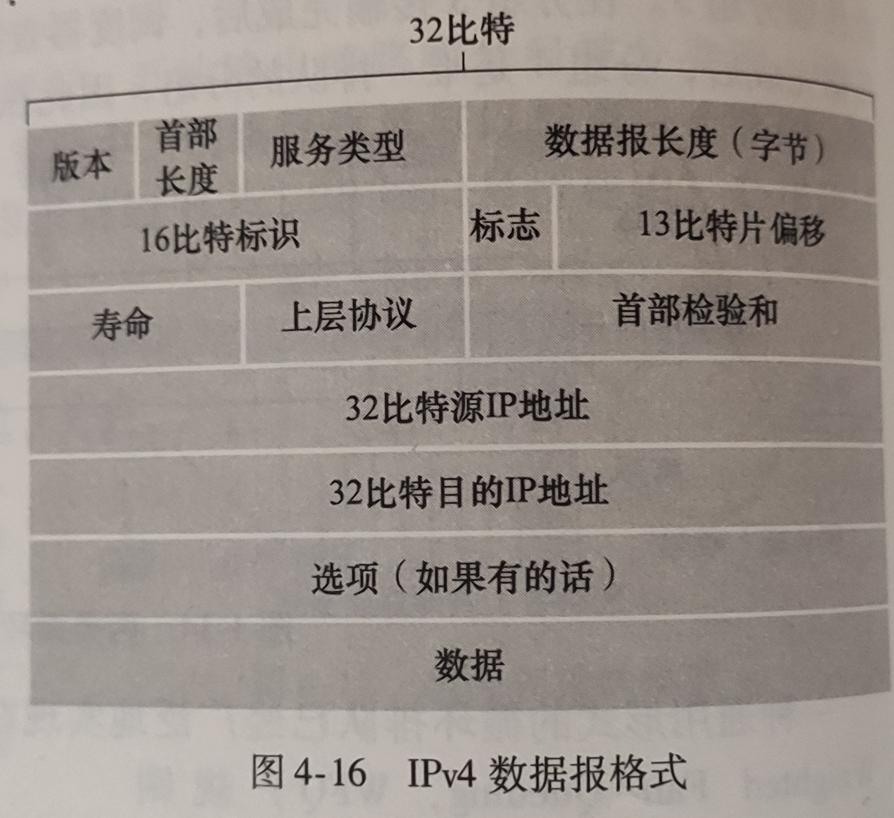

# 网络层
- ## IP 协议
  - IP 是分配给每个用户设备的标签，IP 地址保证了每个设备的唯一性，常用 IP 地址分为 **IPv4** 和 **IPv6** 两种。
  - **版本**： IPv4 或 IPv6
  - **首部长度**：4 位
  - **数据报长度**：首部长度加数据长度
  - **寿命（TTL）**：用于确保数据报不会永远在网络中循环。寿命为 0 时丢弃数据报
  - **上层协议**：指明数据应交给哪一个协议处理
- ## 地址解析协议 ARP
  - 
- ## 网际控制报文协议 ICPM
- ## 网际组管理协议 IGMP
- ## 路由选择协议
- ## 虚拟专用网 VPN
- ## 网络地址转换 NAT